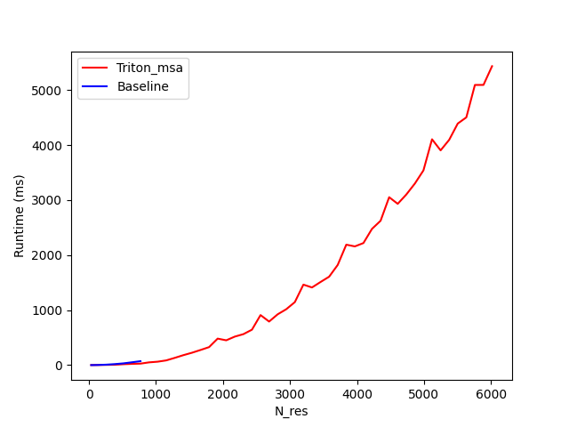
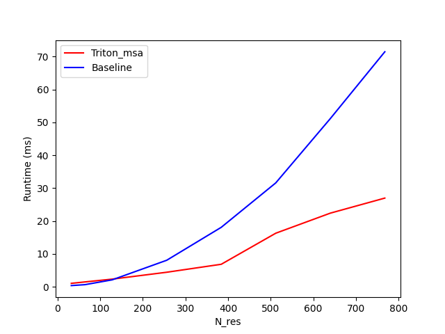
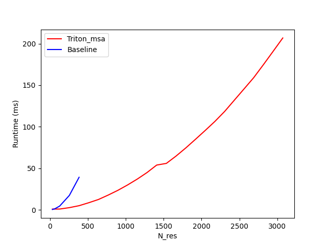

# Fast MSA Pair Weighted Averaging with Gating for AlphaFold3 🧬
This is a Triton implementation of MSA Pair Weighted Averaging with Gating for the Ligo Biosciences [AlphaFold3 open-source implementation](https://github.com/Ligo-Biosciences/AlphaFold3)!
 
The [original implementation](https://github.com/Ligo-Biosciences/AlphaFold3/blob/main/src/models/msa_module.py) has significant memory bottleneck and is memory-bound due to the softmax + weighting mechanism implementation. Here, we fuse both parts to remove extra broadcasting steps and loads.


## Example Setup
The relevant libraries for this portion are
```
pip install triton>=3.0.0
pip install torch
pip install pytest
pip install matplotlib
pip install pandas
```

## Testing Correctness
There is a `pytest` function in `test_benchmark.py` that tests the correctness of the forwards and backwards pass with respect to random inputs. You can modify these tests to do more rigorous correctness tests and check with `pytest`.

## Simple Isolated Example
This module fits into an MSA implementation, but can also be used in isolation.
```python
from msa_kernel import MSAWeightedAveragingFused

B, H, N_seq, N_res, C_hidden = 1, 8, 128, 384, 8

v = torch.randn((B, N_seq, N_res, H, C_hidden), dtype=dtype, device="cuda").requires_grad_()
b = torch.randn((B, N_res, N_res, H), dtype=dtype, device="cuda").requires_grad_()
g = torch.randn((B, N_seq, N_res, H, C_hidden), dtype=dtype, device="cuda").requires_grad_()

msa = MSAWeightedAveragingFused(v, b, g)
...
out.backward(loss)
```

## Benchmarking
We use `pytest` for testing correctness and benchmark runtime performance across the size of `N_res`. 
```
pytest
python test_benchmark.py
```
The tests above use the following parameters:
```python
BATCH_SIZE=1
N_heads=8
N_seq=32
C_hidden=32
C_z=128
C_m=128
```

I've also added a notebook `msa_benchmarking.ipynb` for peak memory and runtime analysis.

#### Forward Pass Runtime
We benchmark the forward pass across `N_res` in increments of 128 until the device runs out of memory.

Here is a zoomed in version for ease of comparison:


#### Backwards Pass Runtime
We benchmark the backwards pass across `N_res` in increments of 128 until the device runs out of memory.

